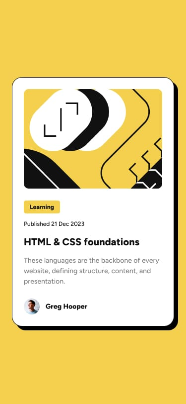

# Cartão de visualização do blog 

Este é um desafio para alunos. O objetivo é criar um  cartão de um blog este projeto deve ficar igual ou mais próximo possível do projeto real. 

 

[] 

 

 

[] 

 

## Desafios 
Para realizar esse desafio revi algumas aulas e fiz pesquisa na internet. Assim consegui superar e adquirir mais experiência com a linguagens de programação.

 
HTML usei as tags picture - button entre outras.  

 

CSS apliquei os estilos no button, images, e inseri a imagem do 'avatar' ultilizando o '::before'. 

 

Foque também em proporcionando um código limpo e de fácil manutenção. 

 

## Tecnologias utilizadas  

- HTML 

- CSS 

 
